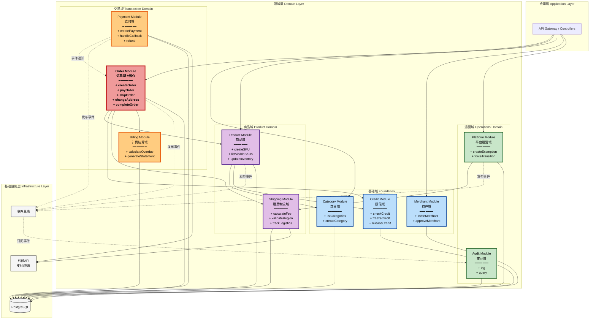
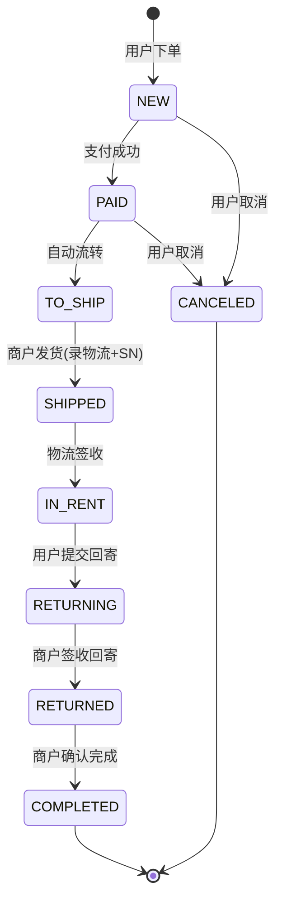
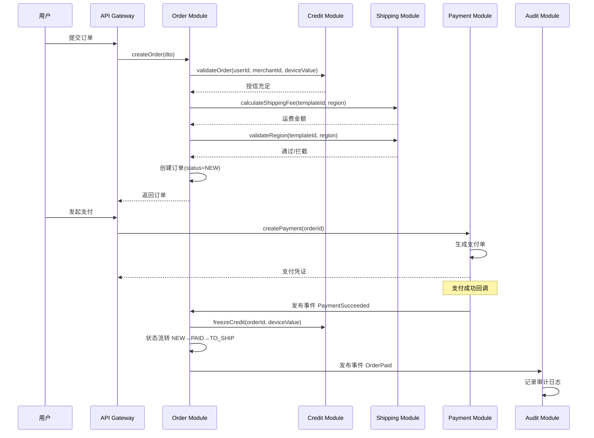
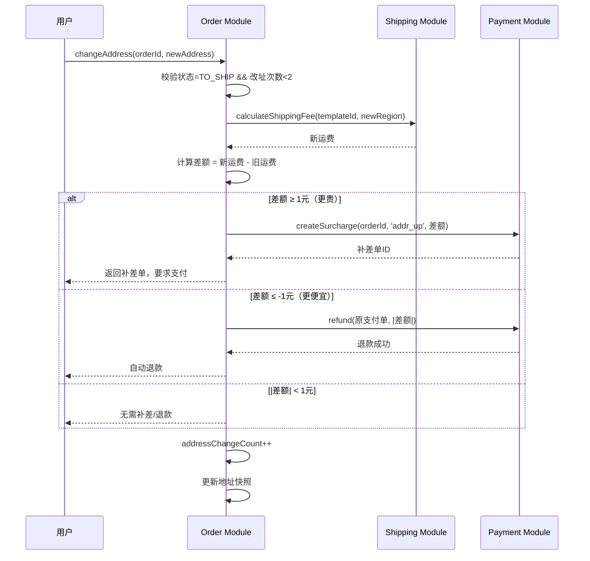
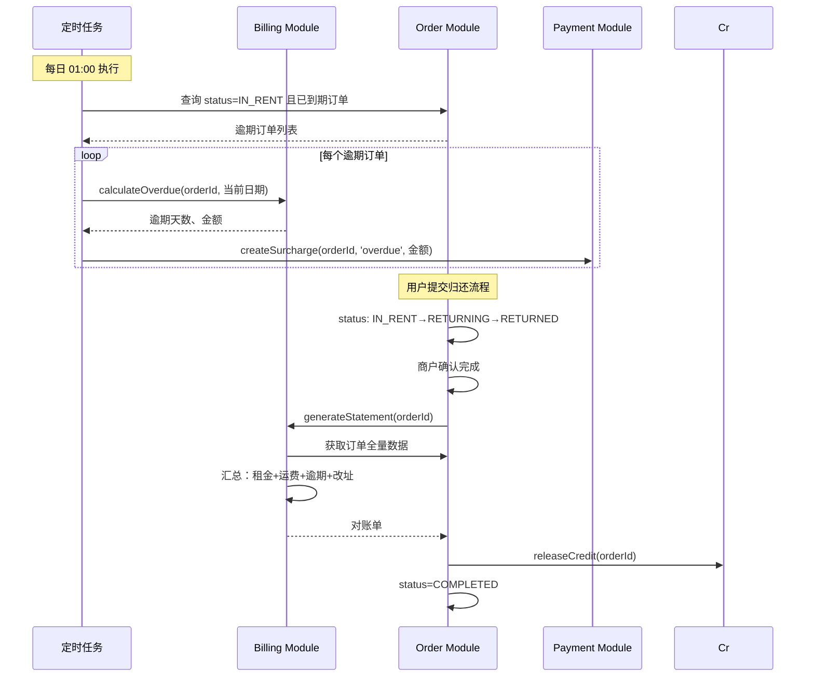
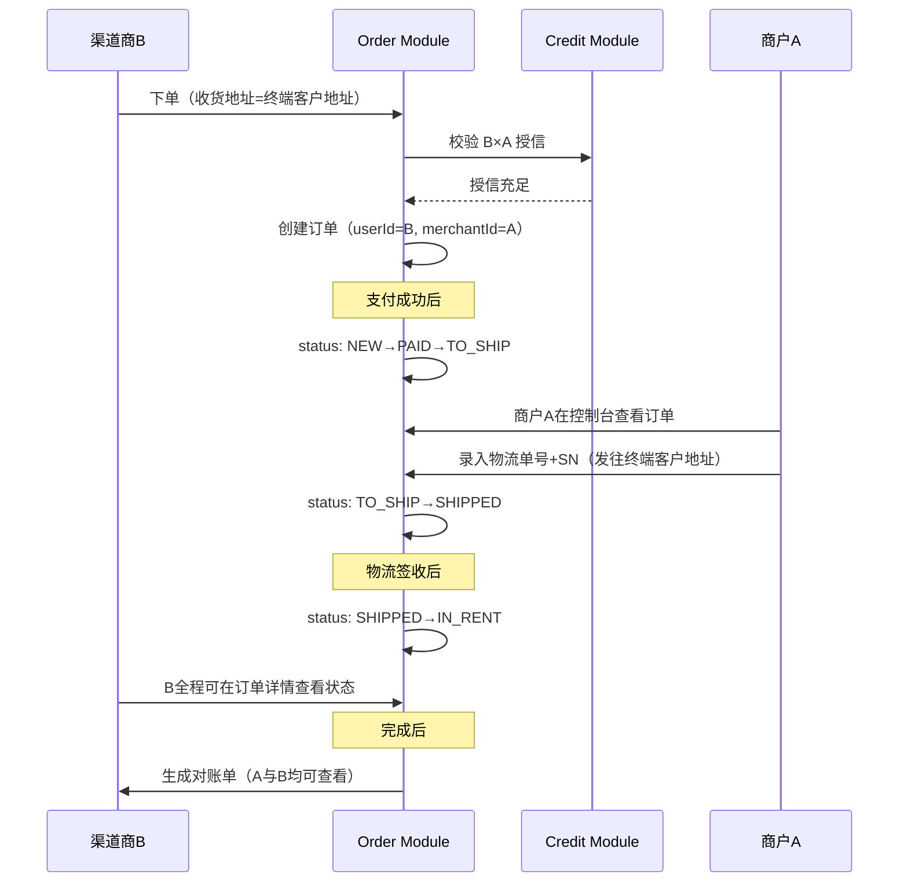

# B2B 同行租赁效率工具 — 技术架构设计 v1.0

> **文档类型**：技术设计文档（TDD）
> **版本**：v1.0
> **日期**：2025-10-09
> **依据**：[PRD v0.2](./prd.md)（货架模型）

---

## 1. 架构总览

### 1.1 分层架构

```
┌──────────────────────────────────────────────────────────┐
│                   Presentation Layer                      │
│  ┌──────────────┐  ┌──────────────┐  ┌──────────────┐   │
│  │ 租方门户(Web) │  │商户控制台(Web)│  │ 平台后台(Web) │   │
│  └──────────────┘  └──────────────┘  └──────────────┘   │
└──────────────────────────────────────────────────────────┘
                           │
                           ▼
┌──────────────────────────────────────────────────────────┐
│                   Application Layer                       │
│               (NestJS Controllers + DTOs)                 │
└──────────────────────────────────────────────────────────┘
                           │
                           ▼
┌──────────────────────────────────────────────────────────┐
│                    Domain Layer                           │
│         (9个业务模块 - 见下方模块划分)                      │
└──────────────────────────────────────────────────────────┘
                           │
                           ▼
┌──────────────────────────────────────────────────────────┐
│                 Infrastructure Layer                      │
│    Prisma ORM │ 外部API(支付/物流) │ 消息队列 │ 缓存      │
└──────────────────────────────────────────────────────────┘
```

### 1.2 技术栈

- **运行时**：Node.js + TypeScript
- **框架**：NestJS (模块化 + 依赖注入)
- **ORM**：Prisma (类型安全 + 迁移管理)
- **数据库**：PostgreSQL
- **CMS**：PayloadCMS (平台后台可选)
- **API 文档**：Swagger/OpenAPI
- **事件总线**：NestJS EventEmitter (MVP) / Redis Pub/Sub (扩展)

---

## 2. 模块划分（Domain Modules）

### 2.1 模块总览

| 模块 | 英文名 | 聚合根 | 核心职责 | 管理角色 | 依赖模块 |
|------|--------|--------|----------|----------|----------|
| 类目域 | Category Module | Category | 类目树管理（CRUD、排序） | 平台方 | - |
| 商品域 | Product Module | MerchantSKU | 商户SKU管理、库存调整 | 商户 | Category, Credit |
| 授信域 | Credit Module | UserMerchantCredit | 授信额度管理、冻结/释放 | 商户 | - |
| 订单域 | Order Module | Order | 订单生命周期、状态机流转 | 用户/商户 | Product, Credit, Shipping, Billing |
| 运费物流域 | Shipping Module | ShippingTemplate, Logistics | 运费模板、地区规则、物流追踪 | 商户 | - |
| 支付域 | Payment Module | Payment, Surcharge | 支付单生成、支付回调、退款 | 系统 | - |
| 计费结算域 | Billing Module | BillingRecord, Statement | 租金计费、逾期计算、对账单 | 系统 | - |
| 商户域 | Merchant Module | Merchant | 商户资料、邀请审核、成员管理 | 平台方 | - |
| 平台运营域 | Platform Module | Exemption, SystemConfig | 豁免审批、强制流转、系统配置 | 平台方 | Shipping |
| 审计域 | Audit Module | AuditLog | 操作日志记录、审计追踪 | 系统 | - (被动) |

### 2.2 模块依赖关系图（UML Package Diagram）



### 2.3 依赖规则说明

#### 强依赖（实线箭头）
- **Product → Category**：SKU 创建时需要选择类目
- **Product → Credit**：过滤可见 SKU（用户授信状态）
- **Order → Product**：下单时校验 SKU 库存
- **Order → Credit**：下单时校验授信、冻结/释放额度
- **Order → Shipping**：计算运费、改址差额
- **Order → Billing**：完成时生成对账单
- **Platform → Shipping**：豁免不发地区拦截

#### 弱依赖（虚线箭头 - 事件驱动）
- **Payment → Order**：支付成功后通知订单模块流转状态
- **所有模块 → Audit**：通过事件总线发布操作日志

#### 禁止的依赖
- ❌ **下层模块不能依赖上层模块**
- ❌ **同层模块之间避免循环依赖**
- ❌ **基础域模块不能依赖业务域模块**

### 2.4 关键设计决策

#### 决策1：拆分 Catalog → Category + Product
**原因**：
- Category 由平台方管理，Product 由商户管理
- 不同角色、不同权限、不同生命周期
- 符合单一职责原则和高内聚原则

#### 决策2：Product 依赖 Credit 的优化
**问题**：过滤可见 SKU 时需要查询授信，可能产生 N+1 查询

**方案**：使用数据库层 JOIN（Prisma relation），不直接调用 CreditService
```typescript
// 在 Product Module 中通过 Prisma 关联查询
prisma.merchantSKU.findMany({
  where: {
    merchant: {
      credits: { some: { userId, status: 'enabled' } }
    }
  }
})
```

#### 决策3：Payment 通过事件解耦 Order
**原因**：
- 支付是外部回调，异步处理
- 避免 Payment Module 强依赖 Order Module

**实现**：Payment 发布 `PaymentSucceeded` 事件，Order 监听并流转状态

#### 决策4：Audit 作为横切关注点
**原因**：所有模块都需要审计，但不应直接依赖

**实现**：通过事件总线自动记录所有领域事件

---

## 3. 模块详细设计

### 3.1 Catalog Module（商品目录域）

#### 职责边界
- ✅ 类目树管理（CRUD、排序、停用）
- ✅ 商户SKU管理（上架/下架、库存调整）
- ✅ SKU可见性过滤（根据授信状态）
- ❌ 不负责：授信额度计算（由 Credit Module）、订单创建（由 Order Module）

#### 核心实体
```typescript
// 聚合根：Category
class Category {
  id: string;
  name: string;
  parentId?: string;
  path: string; // 层级路径，如 "/1/2/3"
  sort: number;
  isActive: boolean;
}

// 聚合根：MerchantSKU
class MerchantSKU {
  id: string;
  merchantId: string;
  categoryId: string;
  name: string;
  dailyFee: number;
  deviceValue: number; // 授信参考值
  inventoryQty: number;
  shippingTemplateId: string;
  isListed: boolean;

  // 业务方法
  checkAvailability(requestedQty: number): boolean;
  decreaseInventory(qty: number): void;
  increaseInventory(qty: number): void;
}
```

#### 对外接口
```typescript
interface CatalogService {
  // 类目
  listCategories(filters: CategoryFilter): Category[];

  // SKU
  listVisibleSKUs(userId: string, filters: SKUFilter): MerchantSKU[];
  getSKUDetail(skuId: string, userId: string): MerchantSKU;
  createSKU(dto: CreateSKUDto): MerchantSKU;
  updateInventory(skuId: string, delta: number): void;
}
```

#### 依赖注入
```typescript
@Module({
  imports: [CreditModule],
  providers: [CatalogService],
  exports: [CatalogService]
})
export class CatalogModule {}
```

---

### 3.2 Credit Module（授信域）

#### 职责边界
- ✅ user×merchant 授信额度管理
- ✅ 授信冻结（下单时）、释放（订单完成/取消时）
- ✅ 超额校验
- ❌ 不负责：订单状态管理（由 Order Module）

#### 核心实体
```typescript
// 聚合根：UserMerchantCredit
class UserMerchantCredit {
  userId: string;
  merchantId: string;
  creditLimit: number;
  frozenAmount: number;
  availableAmount: number; // = creditLimit - frozenAmount
  status: 'enabled' | 'disabled';

  // 业务方法
  canAfford(amount: number): boolean;
  freeze(orderId: string, amount: number): void;
  release(orderId: string, amount: number): void;
  revoke(): void; // 撤销授信
}
```

#### 对外接口
```typescript
interface CreditService {
  checkCredit(userId: string, merchantId: string): UserMerchantCredit;
  validateOrder(userId: string, merchantId: string, amount: number): boolean;
  freezeCredit(userId: string, merchantId: string, orderId: string, amount: number): void;
  releaseCredit(userId: string, merchantId: string, orderId: string, amount: number): void;
  updateCreditLimit(userId: string, merchantId: string, newLimit: number): void;
}
```

---

### 3.3 Order Module（订单域）⭐ 核心模块

#### 职责边界
- ✅ 订单完整生命周期管理
- ✅ 状态机流转（9种状态）
- ✅ 改址逻辑（TO_SHIP阶段）
- ✅ 设备SN绑定
- ❌ 不负责：运费计算（由 Shipping）、支付执行（由 Payment）、计费逻辑（由 Billing）

#### 核心实体
```typescript
// 聚合根：Order
class Order {
  id: string;
  userId: string;
  merchantId: string;
  merchantSKUId: string;
  deviceId?: string; // 发货时绑定
  status: OrderStatus;

  // 快照字段（下单时锁定）
  dailyFeeSnapshot: number;
  shippingFeeSnapshot: number;
  shippingTemplateId: string;
  shippingTemplateVersion: number;

  // 租期
  rentStartDate: Date; // 计费起点
  rentEndDate: Date;
  timezone: string; // 默认 'Asia/Shanghai'

  // 授信
  creditHoldAmount: number;

  // 地址
  shippingAddress: Address;
  addressChangeCount: number; // 改址次数（≤2）

  // 业务方法（状态机）
  pay(): void;              // NEW → PAID → TO_SHIP
  ship(logistics: Logistics): void; // TO_SHIP → SHIPPED
  confirmReceived(): void;  // SHIPPED → IN_RENT
  submitReturn(trackNo: string): void; // IN_RENT → RETURNING
  confirmReturn(): void;    // RETURNING → RETURNED
  complete(): void;         // RETURNED → COMPLETED
  cancel(): void;           // NEW/PAID → CANCELED

  // 改址方法
  changeAddress(newAddress: Address): AddressChangeResult;
}

type OrderStatus =
  | 'NEW'
  | 'PAID'
  | 'TO_SHIP'
  | 'SHIPPED'
  | 'IN_RENT'
  | 'RETURNING'
  | 'RETURNED'
  | 'COMPLETED'
  | 'CANCELED';
```

#### 状态机设计



**状态转移规则表**：

| 当前状态 | 触发动作 | 前置条件 | 目标状态 | 副作用 |
|----------|----------|----------|----------|--------|
| NEW | 支付成功 | 授信充足 | PAID | 冻结授信 |
| PAID | 自动 | - | TO_SHIP | - |
| TO_SHIP | 商户录入物流+SN | SN未被占用 | SHIPPED | 设置 rentStartDate |
| SHIPPED | 物流签收 | - | IN_RENT | - |
| IN_RENT | 用户提交回寄 | - | RETURNING | - |
| RETURNING | 商户签收 | - | RETURNED | - |
| RETURNED | 商户确认 | - | COMPLETED | 生成对账单、释放授信 |
| NEW/PAID | 用户取消 | - | CANCELED | 退款、释放授信 |

#### 对外接口
```typescript
interface OrderService {
  createOrder(dto: CreateOrderDto): Order;
  payOrder(orderId: string, paymentId: string): Order;
  shipOrder(orderId: string, logistics: LogisticsDto): Order;
  confirmReceived(orderId: string): Order;
  submitReturn(orderId: string, trackNo: string): Order;
  confirmReturn(orderId: string): Order;
  completeOrder(orderId: string): Order;
  cancelOrder(orderId: string, reason: string): Order;

  // 改址
  changeAddress(orderId: string, newAddress: Address): AddressChangeResult;
}
```

---

### 3.4 Shipping Module（运费物流域）

#### 职责边界
- ✅ 运费模板管理（地区固定价、不发地区）
- ✅ 运费计算（下单时、改址时）
- ✅ 不发地区拦截
- ✅ 物流信息追踪
- ❌ 不负责：订单状态流转（由 Order）

#### 核心实体
```typescript
// 聚合根：ShippingTemplate
class ShippingTemplate {
  id: string;
  merchantId: string;
  name: string;
  version: number; // 版本号，用于快照
  defaultFee: number;
  regionRules: RegionRule[]; // [{regionCodePath: '/110000/110100', fee: 50}]
  blacklistRegions: string[]; // ['/330000/330100']
  status: 'active' | 'archived';

  // 业务方法
  calculateFee(regionCode: string): number;
  isRegionBlocked(regionCode: string): boolean;
}

// 物流信息
class Logistics {
  orderId: string;
  shipNo: string;
  carrier: string;
  shipAt: Date;
  signAt?: Date;
  returnShipNo?: string;
  returnSignAt?: Date;
}
```

#### 对外接口
```typescript
interface ShippingService {
  calculateShippingFee(templateId: string, regionCode: string): number;
  validateRegion(templateId: string, regionCode: string): ValidationResult;
  getTemplate(templateId: string): ShippingTemplate;

  // 物流追踪
  updateLogistics(orderId: string, logistics: LogisticsDto): void;
  getLogistics(orderId: string): Logistics;
}
```

---

### 3.5 Payment Module（支付域）

#### 职责边界
- ✅ 支付单生成（租金+运费、逾期、补差）
- ✅ 支付渠道对接
- ✅ 支付回调处理
- ✅ 退款处理
- ❌ 不负责：订单状态流转（通过事件通知 Order Module）

#### 核心实体
```typescript
// 聚合根：Payment
class Payment {
  id: string;
  orderId: string;
  type: 'initial' | 'surcharge'; // 初始支付 或 补差/逾期
  amountRent: number;
  amountShipping: number;
  totalAmount: number;
  status: 'pending' | 'paid' | 'refunded';
  channel: string; // 'wechat', 'alipay'
  paidAt?: Date;
  refundedAt?: Date;
}

// 补差/逾期单
class Surcharge {
  id: string;
  orderId: string;
  type: 'overdue' | 'addr_up' | 'addr_down'; // 逾期 | 改址补差 | 改址退款
  amount: number;
  status: 'pending' | 'paid' | 'refunded';
  createdAt: Date;
  paidAt?: Date;
  refundAt?: Date;
}
```

#### 对外接口
```typescript
interface PaymentService {
  createPayment(orderId: string, amounts: PaymentAmounts): Payment;
  createSurcharge(orderId: string, type: SurchargeType, amount: number): Surcharge;
  handlePaymentCallback(callbackData: any): void;
  refund(paymentId: string, amount: number): void;
}
```

---

### 3.6 Billing Module（计费结算域）

#### 职责边界
- ✅ 租金计费起点计算（发货次日00:00）
- ✅ 逾期天数计算（向上取整）
- ✅ 对账单生成（COMPLETED时）
- ❌ 不负责：支付执行（由 Payment）

#### 核心实体
```typescript
// 聚合根：BillingRecord
class BillingRecord {
  orderId: string;
  rentStartDate: Date;
  rentEndDate: Date;
  dailyFee: number;
  actualReturnDate?: Date;
  overdueDays: number;
  overdueAmount: number;

  // 业务方法
  calculateOverdue(returnDate: Date): number;
}

// 聚合根：Statement（对账单）
class Statement {
  id: string;
  orderId: string;
  issuedAt: Date;
  amountTotal: number;
  detailsJson: string; // 包含：租金、运费、逾期、改址差额、设备SN、时间戳

  // 业务方法
  generateFromOrder(order: Order): Statement;
}
```

#### 对外接口
```typescript
interface BillingService {
  calculateRentStartDate(shipDate: Date, timezone: string): Date;
  calculateOverdue(orderId: string, returnDate: Date): OverdueResult;
  generateStatement(orderId: string): Statement;
}
```

---

### 3.7 Merchant Module（商户域）

#### 职责边界
- ✅ 商户资料管理
- ✅ 商户邀请/审核
- ✅ 商户成员与角色管理
- ❌ 不负责：SKU管理（由 Catalog）、订单处理（由 Order）

#### 核心实体
```typescript
// 聚合根：Merchant
class Merchant {
  id: string;
  name: string;
  contact: string;
  settlementAccount: string;
  status: 'pending' | 'active' | 'disabled';
  invitedAt?: Date;
  approvedAt?: Date;
}
```

---

### 3.8 Platform Module（平台运营域）

#### 职责边界
- ✅ 不发地区豁免审批
- ✅ 订单强制流转（解卡）
- ✅ 系统配置管理
- ❌ 不负责：常规订单流转（由 Order）

#### 核心实体
```typescript
// 聚合根：Exemption
class Exemption {
  id: string;
  orderId: string;
  type: 'region_blacklist'; // 豁免类型
  reason: string;
  operatorId: string;
  createdAt: Date;
}

// 聚合根：SystemConfig
class SystemConfig {
  key: string;
  value: string;
  updatedBy: string;
  updatedAt: Date;
}
```

---

### 3.9 Audit Module（审计域）

#### 职责边界
- ✅ 全局操作日志记录
- ✅ 敏感操作追踪（豁免、强制流转、授信变更）
- ❌ 不负责：业务逻辑（仅被动记录）

#### 核心实体
```typescript
// 聚合根：AuditLog
class AuditLog {
  id: string;
  entity: string; // 'order', 'credit', 'exemption'
  entityId: string;
  action: string; // 'create', 'update', 'delete', 'status_change'
  operatorId: string;
  reason?: string;
  before?: any; // JSON
  after?: any; // JSON
  createdAt: Date;
}
```

---

## 4. 跨模块协作流程

### 4.1 下单流程（核心流程）



### 4.2 改址差额流程



### 4.3 逾期计费与对账流程



### 4.4 转单找货流程（B→A 代发）

> **场景说明**：渠道商B接到终端客户订单，但无库存，将订单交由商户A履约。



**关键点**：
- 订单的 `userId=B`, `merchantId=A`
- 收货地址为终端客户地址（非B的地址）
- 对账单同时对 A/B 可见，包含完整明细

---

## 5. API 层设计

### 5.1 API 分组（按端）

#### 租方门户 API (`/api/customer`)

| 端点 | HTTP方法 | 模块 | 说明 |
|------|----------|------|------|
| `/api/customer/catalog/categories` | GET | Catalog | 类目列表 |
| `/api/customer/catalog/skus` | GET | Catalog | 受信商户SKU列表 |
| `/api/customer/catalog/skus/:id` | GET | Catalog | SKU详情 |
| `/api/customer/orders` | POST | Order | 创建订单 |
| `/api/customer/orders/:id` | GET | Order | 订单详情 |
| `/api/customer/orders/:id/pay` | POST | Payment | 发起支付 |
| `/api/customer/orders/:id/cancel` | POST | Order | 取消订单 |
| `/api/customer/orders/:id/address` | PATCH | Order | 改址（TO_SHIP） |
| `/api/customer/orders/:id/return` | POST | Order | 提交回寄 |
| `/api/customer/statements` | GET | Billing | 对账单列表 |
| `/api/customer/statements/:orderId` | GET | Billing | 对账单详情 |

#### 商户控制台 API (`/api/merchant`)

| 端点 | HTTP方法 | 模块 | 说明 |
|------|----------|------|------|
| `/api/merchant/skus` | GET/POST | Catalog | SKU管理 |
| `/api/merchant/skus/:id` | PATCH/DELETE | Catalog | SKU编辑/下架 |
| `/api/merchant/shipping-templates` | GET/POST | Shipping | 运费模板 |
| `/api/merchant/credits` | GET | Credit | 授信列表 |
| `/api/merchant/credits/:userId` | PUT | Credit | 授信额度调整 |
| `/api/merchant/orders` | GET | Order | 订单列表 |
| `/api/merchant/orders/:id/ship` | POST | Order | 录入物流+SN |
| `/api/merchant/orders/:id/confirm-received` | POST | Order | 确认签收 |
| `/api/merchant/orders/:id/confirm-return` | POST | Order | 确认回寄签收 |
| `/api/merchant/orders/:id/complete` | POST | Order | 确认完成 |

#### 平台后台 API (`/api/admin`)

| 端点 | HTTP方法 | 模块 | 说明 |
|------|----------|------|------|
| `/api/admin/categories` | GET/POST/PATCH | Catalog | 类目管理 |
| `/api/admin/merchants` | GET/POST | Merchant | 商户管理 |
| `/api/admin/merchants/:id/approve` | POST | Merchant | 商户审核 |
| `/api/admin/orders` | GET | Order | 全局订单视图 |
| `/api/admin/orders/:id/force-transition` | POST | Platform | 强制流转 |
| `/api/admin/exemptions` | GET/POST | Platform | 豁免管理 |
| `/api/admin/audit-logs` | GET | Audit | 审计日志 |

### 5.2 API 认证与鉴权

```typescript
// JWT Payload
interface JWTPayload {
  userId: string;
  role: 'customer' | 'merchant' | 'platform';
  merchantId?: string; // 仅商户端
}

// 权限守卫
@UseGuards(JwtAuthGuard, RoleGuard)
@Roles('customer')
export class CustomerOrderController {}

@UseGuards(JwtAuthGuard, RoleGuard, MerchantGuard)
@Roles('merchant')
export class MerchantOrderController {}
```

---

## 6. 数据库设计

### 6.1 表结构（Prisma Schema）

```prisma
// ========== Catalog Module ==========
model Category {
  id        String   @id @default(cuid())
  name      String
  parentId  String?
  path      String   // '/1/2/3'
  sort      Int      @default(0)
  isActive  Boolean  @default(true)
  createdAt DateTime @default(now())
  updatedAt DateTime @updatedAt
}

model MerchantSKU {
  id                  String   @id @default(cuid())
  merchantId          String
  categoryId          String
  name                String
  dailyFee            Decimal  @db.Decimal(10, 2)
  deviceValue         Decimal  @db.Decimal(10, 2)
  inventoryQty        Int      @default(0)
  shippingTemplateId  String
  isListed            Boolean  @default(false)
  createdAt           DateTime @default(now())
  updatedAt           DateTime @updatedAt

  @@index([merchantId, isListed])
}

// ========== Credit Module ==========
model UserMerchantCredit {
  userId        String
  merchantId    String
  creditLimit   Decimal  @db.Decimal(10, 2)
  frozenAmount  Decimal  @db.Decimal(10, 2) @default(0)
  status        String   // 'enabled' | 'disabled'
  createdAt     DateTime @default(now())
  updatedAt     DateTime @updatedAt

  @@id([userId, merchantId])
  @@index([userId])
}

// ========== Order Module ==========
model Order {
  id                        String   @id @default(cuid())
  userId                    String
  merchantId                String
  merchantSKUId             String
  deviceId                  String?
  status                    String   // OrderStatus enum

  // 快照
  dailyFeeSnapshot          Decimal  @db.Decimal(10, 2)
  shippingFeeSnapshot       Decimal  @db.Decimal(10, 2)
  shippingTemplateId        String
  shippingTemplateVersion   Int

  // 租期
  rentStartDate             DateTime?
  rentEndDate               DateTime
  timezone                  String   @default("Asia/Shanghai")

  // 授信
  creditHoldAmount          Decimal  @db.Decimal(10, 2)

  // 地址
  shippingAddress           Json
  addressChangeCount        Int      @default(0)

  createdAt                 DateTime @default(now())
  updatedAt                 DateTime @updatedAt

  @@index([userId, status])
  @@index([merchantId, status])
}

// ========== Shipping Module ==========
model ShippingTemplate {
  id                String   @id @default(cuid())
  merchantId        String
  name              String
  version           Int      @default(1)
  defaultFee        Decimal  @db.Decimal(10, 2)
  regionRules       Json     // [{regionCodePath, fee}]
  blacklistRegions  Json     // ['/330000/330100']
  status            String   @default("active")
  createdAt         DateTime @default(now())
  updatedAt         DateTime @updatedAt
}

model Logistics {
  orderId         String   @id
  shipNo          String
  carrier         String
  shipAt          DateTime
  signAt          DateTime?
  returnShipNo    String?
  returnSignAt    DateTime?
}

// ========== Payment Module ==========
model Payment {
  id             String   @id @default(cuid())
  orderId        String
  type           String   // 'initial' | 'surcharge'
  amountRent     Decimal  @db.Decimal(10, 2)
  amountShipping Decimal  @db.Decimal(10, 2)
  totalAmount    Decimal  @db.Decimal(10, 2)
  status         String   // 'pending' | 'paid' | 'refunded'
  channel        String
  paidAt         DateTime?
  refundedAt     DateTime?
  createdAt      DateTime @default(now())
}

model Surcharge {
  id         String   @id @default(cuid())
  orderId    String
  type       String   // 'overdue' | 'addr_up' | 'addr_down'
  amount     Decimal  @db.Decimal(10, 2)
  status     String   // 'pending' | 'paid' | 'refunded'
  createdAt  DateTime @default(now())
  paidAt     DateTime?
  refundAt   DateTime?
}

// ========== Billing Module ==========
model Statement {
  id          String   @id @default(cuid())
  orderId     String   @unique
  issuedAt    DateTime @default(now())
  amountTotal Decimal  @db.Decimal(10, 2)
  detailsJson Json
}

// ========== Merchant Module ==========
model Merchant {
  id                String   @id @default(cuid())
  name              String
  contact           String
  settlementAccount String
  status            String   @default("pending")
  invitedAt         DateTime?
  approvedAt        DateTime?
  createdAt         DateTime @default(now())
  updatedAt         DateTime @updatedAt
}

// ========== Platform Module ==========
model Exemption {
  id         String   @id @default(cuid())
  orderId    String
  type       String   // 'region_blacklist'
  reason     String
  operatorId String
  createdAt  DateTime @default(now())
}

model SystemConfig {
  key       String   @id
  value     String
  updatedBy String
  updatedAt DateTime @updatedAt
}

// ========== Audit Module ==========
model AuditLog {
  id        String   @id @default(cuid())
  entity    String
  entityId  String
  action    String
  operatorId String
  reason    String?
  before    Json?
  after     Json?
  createdAt DateTime @default(now())

  @@index([entity, entityId])
  @@index([operatorId])
}
```

---

## 7. 事件驱动设计

### 7.1 核心事件定义

```typescript
// 订单事件
export class OrderCreatedEvent {
  constructor(public readonly order: Order) {}
}

export class OrderPaidEvent {
  constructor(public readonly orderId: string, public readonly paymentId: string) {}
}

export class OrderShippedEvent {
  constructor(public readonly orderId: string, public readonly logistics: Logistics) {}
}

export class OrderCompletedEvent {
  constructor(public readonly orderId: string) {}
}

export class OrderCanceledEvent {
  constructor(public readonly orderId: string, public readonly reason: string) {}
}

// 支付事件
export class PaymentSucceededEvent {
  constructor(public readonly paymentId: string, public readonly orderId: string) {}
}

// 授信事件
export class CreditFrozenEvent {
  constructor(public readonly userId: string, public readonly merchantId: string, public readonly amount: number) {}
}

export class CreditReleasedEvent {
  constructor(public readonly userId: string, public readonly merchantId: string, public readonly amount: number) {}
}
```

### 7.2 事件订阅示例

```typescript
// Order Module 监听支付成功事件
@Injectable()
export class OrderEventHandler {
  constructor(
    private readonly orderService: OrderService,
    private readonly creditService: CreditService,
  ) {}

  @OnEvent('payment.succeeded')
  async handlePaymentSucceeded(event: PaymentSucceededEvent) {
    const order = await this.orderService.findById(event.orderId);

    // 冻结授信
    await this.creditService.freezeCredit(
      order.userId,
      order.merchantId,
      order.id,
      order.creditHoldAmount,
    );

    // 状态流转 NEW → PAID → TO_SHIP
    await this.orderService.transitionToPaid(order.id);
  }

  @OnEvent('order.completed')
  async handleOrderCompleted(event: OrderCompletedEvent) {
    const order = await this.orderService.findById(event.orderId);

    // 释放授信
    await this.creditService.releaseCredit(
      order.userId,
      order.merchantId,
      order.id,
      order.creditHoldAmount,
    );
  }
}

// Audit Module 监听所有事件
@Injectable()
export class AuditEventHandler {
  constructor(private readonly auditService: AuditService) {}

  @OnEvent('**') // 通配符，监听所有事件
  async handleAllEvents(event: any) {
    await this.auditService.log({
      entity: event.constructor.name,
      entityId: event.orderId || event.id,
      action: 'event',
      operatorId: 'system',
      after: event,
    });
  }
}
```

---

## 8. 部署架构

### 8.1 MVP 阶段（单体部署）

```
┌──────────────────────────────────────┐
│       Nginx (反向代理 + 静态资源)      │
└──────────────────────────────────────┘
                 │
                 ▼
┌──────────────────────────────────────┐
│   NestJS Application (单进程)         │
│   ├─ Catalog Module                  │
│   ├─ Credit Module                   │
│   ├─ Order Module                    │
│   ├─ Shipping Module                 │
│   ├─ Payment Module                  │
│   ├─ Billing Module                  │
│   ├─ Merchant Module                 │
│   ├─ Platform Module                 │
│   └─ Audit Module                    │
└──────────────────────────────────────┘
                 │
                 ▼
┌──────────────────────────────────────┐
│          PostgreSQL                   │
└──────────────────────────────────────┘
```

### 8.2 扩展阶段（微服务拆分）

未来可按模块拆分为独立服务：
- **Core Service**：Order + Credit + Billing（核心域）
- **Catalog Service**：Catalog + Shipping（商品域）
- **Payment Service**：Payment（支付域）
- **Platform Service**：Merchant + Platform + Audit（运营域）

通过 **消息队列（RabbitMQ/Kafka）** 进行模块间通信。

---

## 9. 技术选型建议

| 分类 | 技术栈 | 理由 |
|------|--------|------|
| 运行时 | Node.js 20 + TypeScript | 类型安全、生态成熟 |
| 框架 | NestJS | 模块化、依赖注入、开箱即用 |
| ORM | Prisma | 类型安全、迁移管理、优秀的DX |
| 数据库 | PostgreSQL | ACID、JSON支持、成熟稳定 |
| 事件总线 | NestJS EventEmitter (MVP) | 内置、简单；扩展时可迁移至 Redis/RabbitMQ |
| 缓存 | Redis | 授信额度查询、SKU可见性 |
| 任务调度 | @nestjs/schedule | 逾期计算、卡单巡检 |
| API 文档 | Swagger/OpenAPI | 自动生成、前后端协作 |
| 日志 | Winston + ELK | 结构化日志、可追溯 |
| 监控 | Prometheus + Grafana | 指标采集、可视化 |

---

## 10. 开发建议

### 10.1 模块开发顺序

**Phase 1（基础）**：
1. Merchant Module → Credit Module → Catalog Module
2. 实现授信可见性规则

**Phase 2（核心）**：
3. Shipping Module → Payment Module
4. Order Module（状态机 + 改址逻辑）

**Phase 3（完善）**：
5. Billing Module（逾期 + 对账单）
6. Platform Module（豁免 + 强制流转）
7. Audit Module（审计日志）

**Phase 4（集成）**：
8. 物流API对接、支付回调、前端三端开发

### 10.2 测试策略

- **单元测试**：每个模块的 Service 层（Jest）
- **集成测试**：跨模块协作流程（Supertest）
- **E2E测试**：关键业务流程（下单→发货→完成）

### 10.3 代码组织

```
apps/core/src/
├── modules/
│   ├── catalog/
│   │   ├── catalog.module.ts
│   │   ├── catalog.service.ts
│   │   ├── catalog.controller.ts
│   │   ├── entities/
│   │   │   ├── category.entity.ts
│   │   │   └── merchant-sku.entity.ts
│   │   └── dto/
│   ├── credit/
│   ├── order/
│   ├── shipping/
│   ├── payment/
│   ├── billing/
│   ├── merchant/
│   ├── platform/
│   └── audit/
├── common/
│   ├── guards/
│   ├── decorators/
│   ├── events/
│   └── exceptions/
├── prisma/
│   ├── schema.prisma
│   └── migrations/
├── app.module.ts
└── main.ts
```

---

## 11. 未来扩展点

1. **库存日历**：从简单 `inventoryQty` 升级为按日期的可租库存
2. **价格策略**：动态定价、折扣、会员价
3. **设备管理**：设备维修状态、设备池调度
4. **自动化物流**：对接顺丰/韵达API，自动获取签收状态
5. **智能客服**：订单异常自动提醒、催归还
6. **数据分析**：GMV、履约率、商户评分

---

## 12. 附录

### 12.1 术语表

| 术语 | 英文 | 说明 |
|------|------|------|
| 聚合根 | Aggregate Root | DDD 中的核心实体，负责维护业务不变性 |
| 事件溯源 | Event Sourcing | 通过事件重放恢复状态 |
| CQRS | Command Query Responsibility Segregation | 读写分离 |
| 幂等性 | Idempotency | 重复调用不产生副作用 |

### 12.2 参考资料

- [NestJS 官方文档](https://docs.nestjs.com/)
- [Prisma 官方文档](https://www.prisma.io/docs/)
- [领域驱动设计（DDD）](https://www.domainlanguage.com/ddd/)

---

**文档结束** | v1.0 | 2025-10-09
